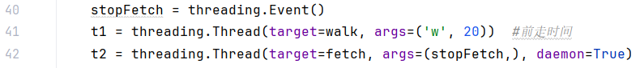

无限暖暖种植采集脚本  
要求:
1. 一定要以管理员方式运行python,否则pyautogui无法模拟鼠标键盘行为
2. 运行main.py开始
3. 按键盘上的End终止程序
4. 请注意环境配置
5. 视情况降低游戏画质
6. 田地如此摆放
  

需要修改的内容:
1. ../main/gatherImage 文件下的图片,因为每个人的电脑对于图标的缩放不一样,可能导致checkImage方法无法识别对应图片.  
    具体替代方法为使用截图软件截取对应图片(如:将项目中的pearl.png替换为你的游戏界面的左上角的美鸭梨,注意尽可能图片中只有美鸭梨,否则随着场景切换可能无法识别)
2. 如果不希望自动购买种子也可以删去buy方法
3. gather.py 的pressKey方法的key参数,或者确保游戏中按下6切换为种植能力套装
  

4. 前走时间与后走时间 gather.py  (可能无需修改)

